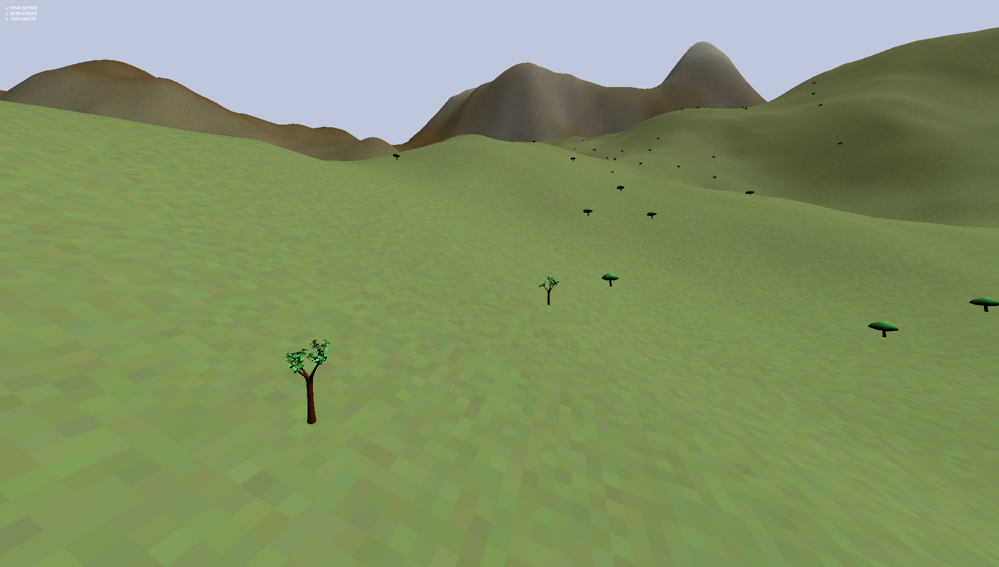
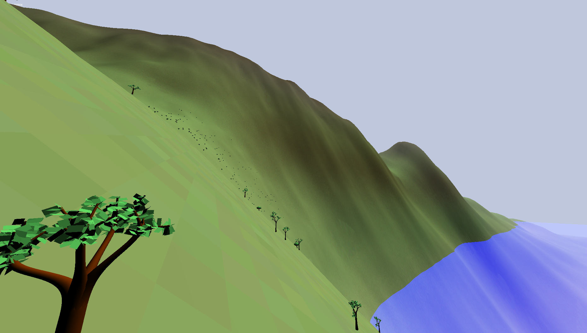
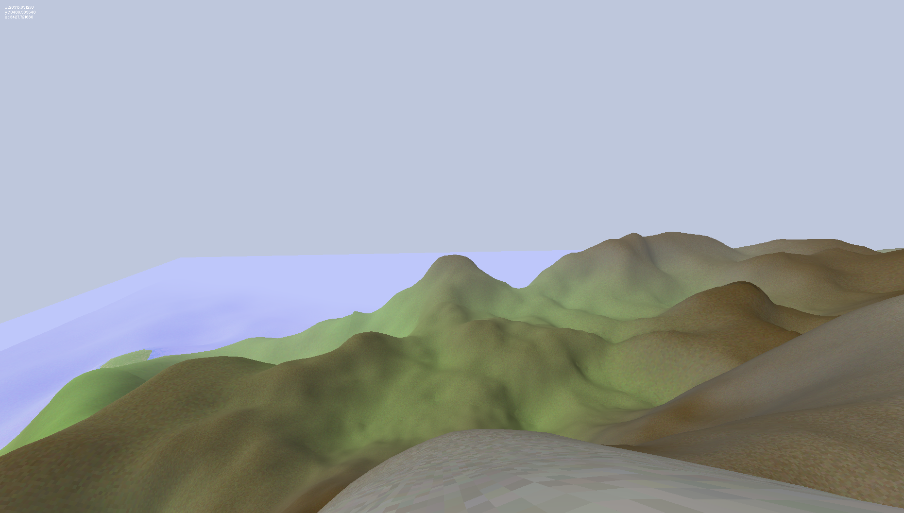

# World

**World** is a C++ library that aims at providing a large collection of tools to generate
a virtual environment procedurally. With World, you can create an unbounded virtual
world from scratch, customize the generation parameters and then get back all the
needed assets to render scenery.

This repository includes a graphical demo to browse worlds generated by the library,
and a graphical editor to play with different world configurations.

## Screenshots




Some examples of landscapes generated by World

## Using World

World has been built for Windows and Linux. To use the library, just get the required
headers and libraries for your system. There are downloadable packages on the release
page.

You can also build World from sources.

## Building World

The World project is built using [CMake](https://cmake.org/install/).
Ensure that you have all the dependencies and that you have installed cmake, then run
the followings commands:

```
mkdir build
cd build
cmake [WORLD_SOURCE_DIRECTORY]
# if you are using gcc
make
make install
```

where *WORLD_SOURCE_DIRECTORY* is the path to the folder containing this repository on
your computer.

You can also build World on Windows with MinGW or Visual Studio. All you need is
generating the right build files with cmake.

### World3D

The graphical demo, called "World3D", is based on the [Irrlicht](http://irrlicht.sourceforge.net/)
engine. If you have Irrlicht installed, World3D will be built along with the project.

If CMake can not find the Irrlicht libraries, you can help out by passing the path to 
Irrlicht as a command line argument: 
```
cmake -DCMAKE_PREFIX_PATH=[PATH_TO_IRRLICHT] [WORLD_SOURCE_DIRECTORY]
```

### WorldGUI

WorldGUI is an editor to edit world configurations and create complex generators.

You can use Qt creator to build WorldGUI. Open the *.pro* file, and configure the project to
get it work with your compiler. Then add this to the qmake command line : 
`"WORLDAPI_SOURCES=[WORLD_SOURCE_DIRECTORY]" "WORLDAPI_LIBDIR=[WORLD_BIN_DIRECTORY]"`

Then ensure you have the libraries required to run the application in the qt build folder.
