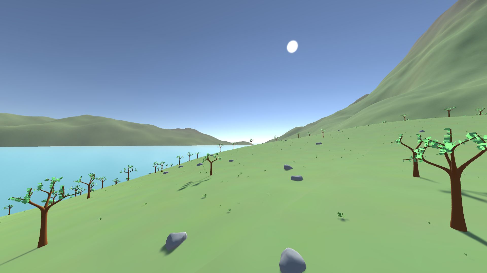

# A Procedural World Generation Library



**World** is a C++ library and collection of tools to create a whole unlimited
virtual world, using only procedural generation techniques. With a given configuration,
the library can generate a large amount of assets (meshes, textures, shaders...) and
integrate them all together in a single scene. Then you can render it with your favorite
tool, even in real time!

Please check the [World Intro](https://github.com/BynaryCobweb/world/tree/develop/docs)
if you want to know more about the library.

## Features

- Procedural Content Generation including terrains, trees, grass, rocks...
- Real-time generation, enabling unlimited free exploration
- Automatic level of details management
- A flexible C++ API to craft exactly the world that you want.

The repository also includes:
- VkWorld: Module that uses Vulkan to generate textures using shaders
- World3D: Real-time demo using [Irrlicht](http://irrlicht.sourceforge.net/) engine
- Peace: World package for Unity. Embeds a real-time demo too (this is where the
screenshot comes from)

There are also a bunch of embryonic packages that are not worth mentioning yet
but may be up to future development (Pyworld, blender integration, WorldGUI)

## Install

### As a library

You can download an archive containing the version of the library that is suited to
your operating system [here](https://github.com/BynaryCobweb/world/releases). *World*
was compiled for Linux 64 bit and Windows 64 bit. If you are on Windows and you do
not use MSVC, you may consider building the library from sources.

The archive contains the required binary files and headers to run World along your
project. If you only use World, no dependency is required. Vkworld requires Vulkan
to be installed. On Linux with an Intel CPU, you can install Vulkan easily with your
favorite package manager:

<!-- TODO There might be a better way -->
```
sudo apt install libvulkan1 mesa-vulkan-drivers vulkan-utils
```

If you can not do that please visit the [official page](https://vulkan.lunarg.com/)
and follow the instructions there. Those are really good instructions, I guess.

### As a Unity Plugin

You can download *Peace* (World Plugin for Unity) [here](https://github.com/BynaryCobweb/world/releases).
Just add it to your Unity project and it should be working.

<!-- TODO add a tutorial on how to add it to you Unity project
Don't forget to add both windows and linux library in the distributed plugin -->

### Try the demo

You can download a demo of World [here](https://github.com/BynaryCobweb/world/releases).
Pick the version that corresponds to you system. After downloading, unzip the archive
and run `WorldDemo.exe`.

Controls are:
- Arrows to move
- Mouse wheel to change speed
- Esc to pause and display overlay with information
- Alt-f4 to quit

### From source

See #Build section below.

## Build

The World project is built using [CMake](https://cmake.org/install/).
All the required dependency to build the core library are included in the repository.
Clone it somewhere on your computer, then run the following commands, where
*WORLD_SOURCE_DIRECTORY* is the path to the cloned repository.

```
mkdir build
cd build
cmake [WORLD_SOURCE_DIRECTORY]
```

#### If you are using GCC

Run:
```
make
```

#### If you are using Visual Studio

Open the generated `.sln` file containing the solution for the whole project.
Then click on `Build > Build Solution` and it will compile all the binaries.

### Dependencies

By default, every existing projects in the repository will be built if their required
dependencies are installed. When you run `cmake`, it tries to find the dependencies,
and display a message indicating whether it found the dependency or not. If *World*
does not find the dependency for some reason, you can hint `cmake` with the path
where you have it installed:

```
cmake -DCMAKE_PREFIX_PATH="[PATH_TO_DEPENDENCY_1];[PATH_TO_DEPENDENCY_2]" [... other arguments]
```

Here is a table of the dependencies for each project:

| Project | Required dependencies |
| --- | --- |
| World3D | Irrlicht |
| VkWorld | Vulkan |
| World3D with Vulkan support | Irrlicht, Vulkan |
| Peace native libraries | No dependency |
| Peace native libraries with Vulkan support | Vulkan |

To install them you can go on these sites:
- [Vulkan](https://vulkan.lunarg.com/)
- [Irrlicht](http://irrlicht.sourceforge.net/)

<!--
### WorldGUI

WorldGUI is an editor to edit world configurations and create complex generators.

You can use Qt creator to build WorldGUI. Open the *.pro* file, and configure the project to
get it work with your compiler. Then add this to the qmake command line :
`"WORLDAPI_SOURCES=[WORLD_SOURCE_DIRECTORY]" "WORLDAPI_LIBDIR=[WORLD_BIN_DIRECTORY]"`

Then ensure you have the libraries required to run the application in the qt build folder.
-->
