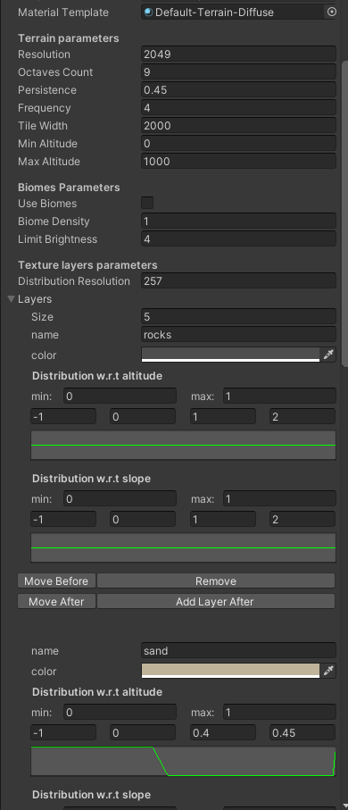
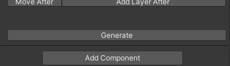

# Unity Peace plugin documentation

## Terrain system

This plugin allows you to create procedural terrains as big as you want and texturing
them according to some rules on altitude and slope.

The procedural terrain generation is managed by a **Terrain System**. To add a
**Terrain System** to your scene, click GameObject > World > Terrain System.
Then click on the **Terrain System** object in the scene hierarchy to start tweaking
parameters as you want.

### Parameters



- **Material template**: The material of the generated terrain. It is recommended to
choose a terrain material, e.g. `Default-Terrain-Diffuse`

**Terrain parameters**

- **Resolution**: The resolution of a terrain tile. This corresponds to **Heightmap Resolution**
parameter in terrain settings.
- **Octave Count**: Number of Perlin octave for the terrain. The higher, the more details will
be generated.
- **Persistence**: Prominence of details on the terrain. A low persistence makes terrains smoother,
while a higher persistence makes the relief very dense.
<!-- Insert illustration of octaves and persistence -->
- **Frequency**: Base frequency used by the fractal noise algorithm. A low frequency means more
large scale structures.
- **Tile Width**: Size of a terrain tile in world coordinates system.
- **Min altitude**: Lowest possible altitude for the terrain.
- **Max altitude**: Highest possible altitude for the terrain.

**Biome parameters**

- **Use Biomes**: If this parameter is activated, the terrain will exibhit a lot of variety in
relief types: mountains, plains, oceans, hills. There are currently not much control over how
the zones are generated, so using biomes can lead to a lot of randomness and unpredictability in
the created terrain.
- **Biome Density**: If **Use Biomes** is activated, this parameter controls the density of
the different relief zones. If the density is high, the relief can change a lot over short distances.
- **Limit Brightness**: The higher, the more sharp the limit between relief zones will be.

**Texture layers parameters**

- **Distribution Resolution**: Resolution of the alphamaps used to texture the terrain.
- **Layers**: a list of parameters for each terrain layer that will be generated. The
parameters control the repartition of the layers on the terrain depending on altitude
and slope.

Here are the parameters available for each layer:

- **name**: A name for the layer. This is useful to know which layer represents which physical
feature of the terrain, for example rocks or grass.
- **color**: A single color texture will be generated for each layer. This texture can be changed
later.
- **Distribution w.r.t. altitude**: These parameters control the texture distribution relatively
to the altitude of the terrain.
- **Distribution w.r.t. slope**: These parameters control the texture distribution relatively
to the slope of the terrain.

The two distribution curve behave the same way: they represent the distribution from the minimum
altitude / slope to the maximum altitude / slope. A high value means that the layer is highly
represented at this altitude / slope, a value of 0 means that the layer is absent for this
altitude / slope. Altitude ranges from minimum altitude to maximum altitude, as specified in
the terrain parameters. Slope ranges from 0 degres to 90 degres.

Each curve is controlled by its minimum value, its maximum value, and four keypoints. The default
Terrain System comes with 5 layers, so you can play around with the keypoints to see how they
affect the curve.

### Generation

Once you selected the correct parameters, scroll down to the bottom of the **Terrain System**
component and click `Generate`. This will create a terrain at (0, 0). Then you can expand it
by selecting the **Terrain System** and clicking on the white squares in the scene view.



If you want to remove a terrain, simply delete the associated game object in the hierarchy.
You can then add it back if you want, but your modifications will be gone.

If you changed the parameters after generating terrain, you need to regenerate the terrain
for you changes to apply. To do so, just click the `Regenerate` button at the bottom of the
**Terrain System** component.

```
/!\ Beware: Clicking on Regenerate button erase all
modifications you may have done on the previously
generated terrain, creates a totally new terrain
and remove all textures in the cache (see below).
So be careful with it!
```

### Changing textures

Currently there is no UI to change the texture. To do so, you will have to replace some files
in the world cache directory.

Each time you generate a terrain, *World* creates a cache directory named `_world` in the
Asset folder. This cache directory contains height maps and textures generated by the library.

The generated terrain textures are located in `_world/ground/worker3/texProvider/` if biomes are
activated, or `_world/ground/worker2/texProvider/` if they are not. To change the texture of a
layer, replace the image file corresponding to this layer. Reloading the terrain may be required
for your change to apply to already generated terrain.