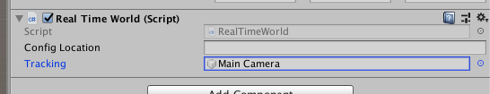

# Peace: First steps

Peace is the plugin that brings World to Unity (pun intended). Here is a tutorial
step by step on how to implement your first real-time endless generating world
in Unity using World.

## Add the plugin to your project

Go to `Assets > Import Package > Custom Package`.
Select the package in your filesystem (you have to download it first from the
[release page](https://github.com/BynaryCobweb/world/releases)).
A list of files will appear, tick everything if it's not, then confirm your choice.

## Create the scene

- Add a camera. Set the clipping planes to near = 1 and far = 10000. You can add
a camera controller to be able to move in the scene. If you do not have a camera
controller, move the camera to (0, 2500, 0) and point it downward.
- Add empty at (0, 0, 0). You can name it `World`, or anything else that please
you.
- Add a RealTimeWorld script to it. <!--
You can pick the demo you want. Leave empty for default. Available demos are: ... -->
- Drag the camera to the field `Tracking` of the RealTimeWorld component

- Run!

## Future improvements

At the moment the plugin is not very useful, you can only recreate the demo shipped
with the project.

In the near future you will be able to pick a json file containing a description
of your world and explore it in real time in Unity.

<!--
Features I want to implement:
 - world autocompletion (interpolation): design your level, put an endlessly
    generated world around!
 - during level design:
    - put an empty somewhere
    - Attach a world script that specify: radius, maximum resolution
    - Click 'Regenerate' to add all the assets
    - Interactive generation: user modification can be returned to world
-->
